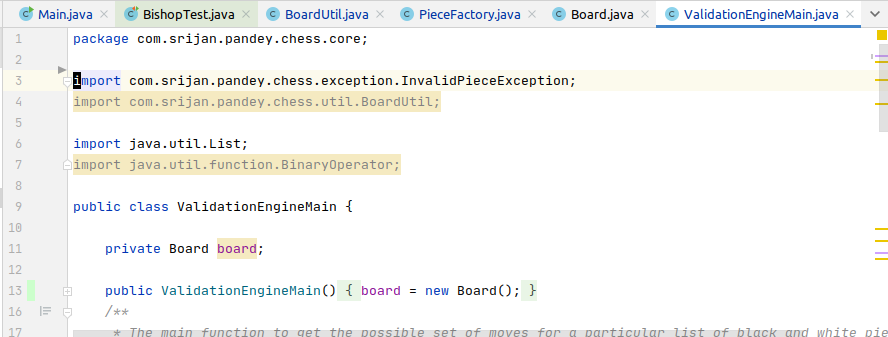
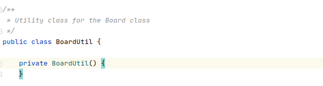
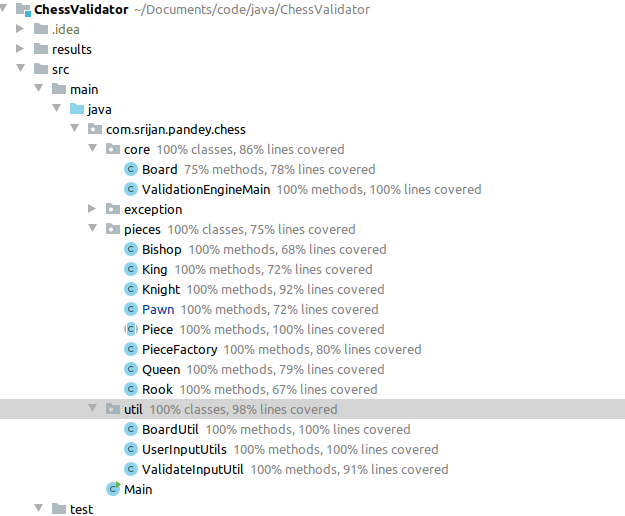
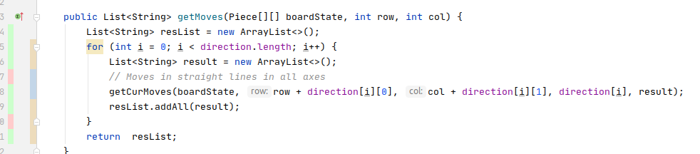

# Chess Validation
### Understanding Software Verification and Validation Proces:

This is a project that validates chess ruleset. This project attempts to understand software testing and validation process to build dependable software system. The scope of the project is to understand the use of **test cases** and **static analysis tools** such as Sonarcube/Intellij Analyzers to identify bugs in a program. 

Some questions that the project answers: 
1. How do you write clean code?
2. How can you find bugs in a software system? 
3. What tools are available to write dependable software systems? 
## Running The Test Code: 

    > mvn clean test

or 

Go to Intellij and run the tests individually

## Report: Static Code Analysis Tool:
For this project, I used two static code analysis tool. 
1. Intellij Native Code Analysis
2. SonarCube

### Improvement Using Static Analysis Examples:
1. Static code analysis gave me insights into unused code and imports which I removed from my code. 

**Unused Import**

 

**Unused Variable**

**Undefined Comments**

1. I found out areas of code that can be refactored or improved. For instance, I imporved code at places to use foreach instead of for loop. This, helps simply the code and also reduce bugs in future development of this project. 

2. I also used private class constructor for static utility classes after using static code analysis. This ensured that future developers cannot instantiate the utility classes.

3. There were instances where certain variables were not being changed throughout the state of the application. For instance, `Piece[][] chessBoard` doesn't get replaced during the whole lifecycle of the application. This was caught by static code analysis, and I changed it to final. This is a really good suggestion, as usually as project grows larger it's difficult to identify issues due to variable mutability. Setting the value of variable to final prevents reassigning a variable with a new one, and adds a degree of consistency. (Note, you can change variables even if they are final Eg: `board.getChessBoard()[0][1] = ...`) 

Another Example of detection of superfluous mutable variable.

4. There were instances when the actual warnings weren't applicable for my use case. For instance, Sonarcube complained to use a logger instead of `System.out.println`. While it is advised to use logging, it didn't make sense for me to use logging for this project, due to the small scope of my project.

5. Likewise, despite complaints from sonarcube, there were places the `for loop` was a better suit rather than `foreach` loop.

## Report: Final Code Coverage: 

### Thought Process: 
I used **Line Coverage** and **Branch Coverage** for this project. I usually started out thinking about what are the possible set of inputs that would give me a reasonable chance of covering all cases, and ascertaining a degree of confidence that my code will work. This would lead me to build testcases as follows.

    /**
    * Test Case:
    * 1. Left Edge
    * 2. Right Edge
    * 4. In front of friend
    * 5. In front of enemy
    *
    */

For cases where I didn't use a mocked variables inside the class. I thought about what are the possible result sets and exceptions the underlying classes threw, that would lead my current class methods to branch out. For instance: 

     /**
     * Test For Populate Board
     * 1. Piece Not Found Exception Zc1
     * 2. With Valid Sets of Values
     * These test cases should cover all the lines in the class.
     * Additional lines in the underlying classes need not be tested with
     * the test case as there are other test cases/ test classes that test
     * those functionality
     */
    @Test
    void testPieceNotFound_WhenPopulatingBoard() {

This gave me a reasonable idea of testing scenarios and I wrote test cases based on these insights.

I also thought about if a test case had good line coverage but not good branch coverage. For instance for a code like below.

    if (useBasicInterceptor)
        interceptor = new RequestInterceptor();
    interceptor.verify(request);

Having a `useBasicInterceptor` as true would lead to full code coverage, but the code would still fail in case the value of the boolean is false.

### Code Coverage: 

Overall I tested almost all of the classes using my test cases. I didn't test classes such as custom `Exception` classes as they didn't have any lines that were worthwhile for testing. I got on average *86%* line coverage on most classes.

**Main Coverage Results**

**Pieces Package Coverage**

**Util Package Coverage**

**Core Package Coverage**

**Coverage Class View**

**Maven Test Result**

### Limitations: 

1. The default Intellij IDE might actually have a bug and at times doesn't report the code coverage well. For instance, for code comments, which cannot be covered using testing, is highlighted as not covered in intellij. likewise, some cases which are covered by testcases are shown as not covered intellij.

**Comments shown as not covered**

**Covered test case shown as not covered**

Another Example of case not shown: 

**Piece Factory Exception Coverage Case**

**Piece Factory Coverage Issue**

2. Mockito also has an issue with mocking out Static classes, because of which I had to refactor certain parts of code.

3. I also needed to add an extra library `mockito-inline` to be able to test out `final` classes. 

4. Certain code cannot be tested without refactoring it. For instance, I could not test the `UserInputUtils` class without having an instance of this class. This is because, the scanner class that takes user inputs needed to be mocked and local variable mocking is difficult using Mockito. Thus, to make `Scanner sc` as an instance variable (to mock it), I had to refactor this code. Note: two major way, mockito mocks classes is using constructor and setter injection, which was the cause for limiations for local variable mocking.

**Refactoring User Input Util from static to inline to mock Scanner**

**Inline User Input**

## Observations

1. I realized that writing test cases that actually address branch coverage is difficult to write. For, most of the cases, my code achieves branch coverage and line coverage. Even with this, this doesn't cover all the test case in the project. The chess board contains 64 individual places and extremely large number of possible board states. That being said, writing testcases that I wrote found bugs that were there in the program such as missing null checks, wrong values in `direction` providing arrays which otherwise would have caused the game to fail. 
 
2. I also realized while working on the testing part of the project, that to write clean testcases, requires that your code also follow clean code practices. This could be things such as, having utilities, using SOLID principles, refactoring and reducing number of lines in functions and classes.

3. Writing test case is really hard work. It takes a lot of thinking into edge cases and if branches have been covered or not. It also requires a lot of effort writing out the test cases. For instance, this code might actually have more testcode than the actual code logic.

## Improvement Scope

1. From writing and thinking about the testcases I realized that there are some improvements that can be done in my code. For instance, while there is a `Piece Factory` in my code that needs to handle creation of Pieces in my application, I don't prohibit calling the constructor of the Pieces (ie: King etc) to create these objects. While making testcases, I realized that at times, I would just call the constructor which would initialize the piece without setting in the isPlacePiece attribute which caused errors in my code. To minimize it's use in the actual code, I have declared the Piece constructors as `protected` restricting it's access to only the classes inside the `com.srijan.pandey.util.pieces`. 

2. I also decided to not consider the double move case for pawn at the start of it's move. The code can be enhanced to support this feature. 

3. Better testsets could have been written. My testing efforts were longer due to the mere fact that my `CreateBoardUtil.java` class didn't return the output results. I made a lot of mistakes while writing the testcases because of this.

    // Only Returns input testcases and not results
    public static Piece[][] getRookAt_1h() {
        Board board = new Board();
        String[] blackPiece = {"Rh1"};
        String[] whitePiece = new String[]{};
        board.populateBoard(blackPiece, whitePiece);
        return board.getChessBoard();
    }

## Future Work: 
Extend this project using JavaFx/Swing to graphically visualize all the possible moves of the chess board.
